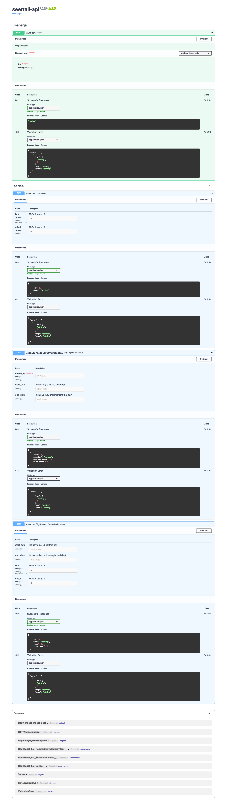

# seertall-api

## Utvikle lokalt

### Oppsett

```sh
poetry install
```
Du trenger en lokal database og redis:

```sh
docker compose up postgres redis --detach
```

### Start server

```sh
uvicorn seertall_api.main:app
```

eller kjør alt på en gang

```sh
docker compose up --build
```

### Populere database

I en annen shell-tab:

```sh
curl --include http://localhost:8000/ingest --form file=@./datasets/Datasett_seertall_NRK_2018.csv
```

### Swagger

Besøk http://127.0.0.1:8000

Her er et skjermbilde:


